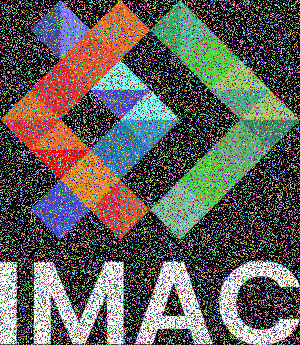

# 🐣 S1 | Prog: Workshop : Rapport

## ⭐ Ne garder que le vert


## ⭐ Échanger les canaux
  
Pour ce exo j'ai utilisé la fonction `std::swap()` :
```cpp
std::swap(image.pixel(x,y).r, image.pixel(x,y).b);
```

## ⭐ Noir & Blanc
 
Utiliser la formule `0.3*image.pixel(x,y).r + 0.59*image.pixel(x,y).g + 0.11*image.pixel(x,y).b` pour obtenir les tons gris.

## ⭐ Négatif
  
```cpp
image.pixel(x,y).r = 1 - image.pixel(x,y).r;
``` 

## ⭐ Dégradé
  
```cpp
image.pixel(x, y) = glm::vec3 (static_cast<float>(x) / static_cast<float>(image.width() - 1));
``` 


## ⭐⭐ Miroir
  
```cpp
glm::vec3& leftPixel = image.pixel(x,y);
glm::vec3& rightPixel = image.pixel(width - 1 - x, y);
std::swap(leftPixel,rightPixel);
```

## ⭐⭐ Image bruitée

```cpp
image.pixel(x,y).r = 1 - image.pixel(x,y).r;
``` 
