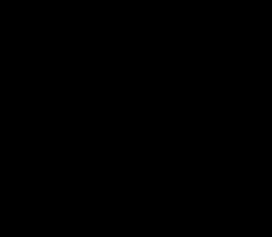
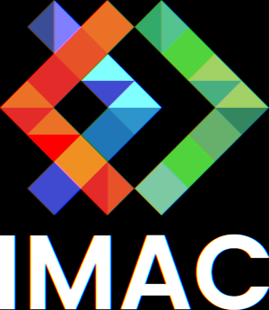
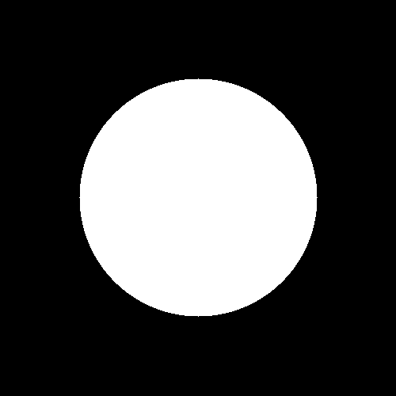
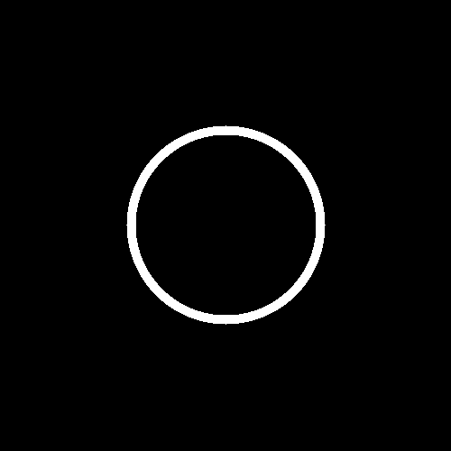
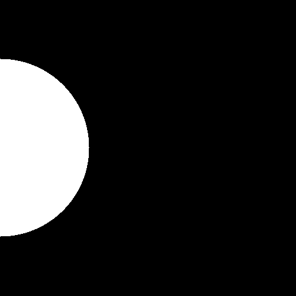
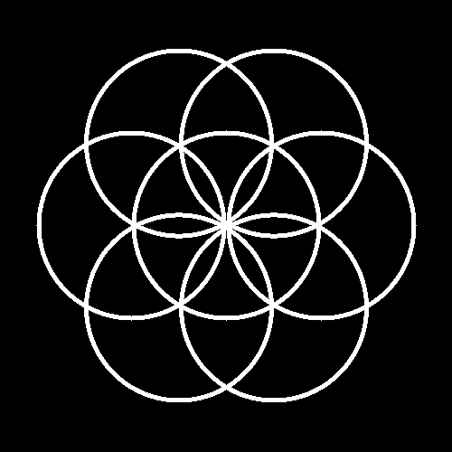
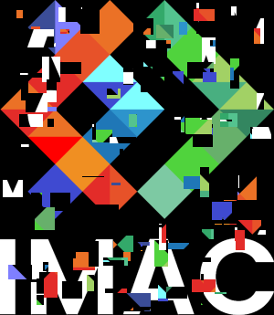

- [🐣 S1 | Prog: Workshop : Rapport](#-s1--prog-workshop--rapport)
  - [⭐ Ne garder que le vert](#-ne-garder-que-le-vert)
  - [⭐ Échanger les canaux](#-échanger-les-canaux)
  - [⭐ Noir \& Blanc](#-noir--blanc)
  - [⭐ Négatif](#-négatif)
  - [⭐ Dégradé](#-dégradé)
  - [⭐⭐ Miroir](#-miroir)
  - [⭐⭐ Image bruitée](#-image-bruitée)
  - [⭐⭐ Rotation de 90°](#-rotation-de-90)
  - [⭐⭐ RGB split](#-rgb-split)
  - [⭐⭐ Luminosité](#-luminosité)
  - [⭐⭐(⭐) Disque](#-disque)
  - [⭐ Cercle](#-cercle)
  - [⭐⭐ Animation](#-animation)
  - [⭐⭐⭐ Rosace](#-rosace)
  - [⭐⭐ Mosaïque](#-mosaïque)
  - [⭐⭐⭐⭐ Mosaïque miroir](#-mosaïque-miroir)
  - [⭐⭐⭐ Glitch](#-glitch)

# 🐣 S1 | Prog: Workshop : Rapport

## ⭐ Ne garder que le vert


## ⭐ Échanger les canaux
  
Pour ce exo j'ai utilisé la fonction `std::swap()` :
```cpp
std::swap(image.pixel(x,y).r, image.pixel(x,y).b);
```

## ⭐ Noir & Blanc
  
Utilisation de la formule `0.3*image.pixel(x,y).r + 0.59*image.pixel(x,y).g + 0.11*image.pixel(x,y).b` pour obtenir les tons gris.

## ⭐ Négatif
  
```cpp
image.pixel(x,y).r = 1 - image.pixel(x,y).r;
``` 

## ⭐ Dégradé
  
```cpp
image.pixel(x, y) = glm::vec3 (static_cast<float>(x) / static_cast<float>(image.width() - 1));
``` 


## ⭐⭐ Miroir
  
```cpp
glm::vec3& leftPixel = image.pixel(x,y);
glm::vec3& rightPixel = image.pixel(width - 1 - x, y);
std::swap(leftPixel,rightPixel);
```

## ⭐⭐ Image bruitée
  
Utilisation de `rand()` pour changer aléatoirement les pixels.

## ⭐⭐ Rotation de 90°
  
```cpp
new_image.pixel(height - 1 - y, x) = image.pixel(x,y);
```

## ⭐⭐ RGB split
  
Utilisation de conditions ternaires pour décaler les pixels :  
```cpp
glm::vec3 leftpix = (x >= val) ? image.pixel(x - val, y) : image.pixel(x,y);
glm::vec3 rightpix = (x < width - val) ? image.pixel(x + val, y) : image.pixel(x,y);
```

## ⭐⭐ Luminosité
    
Utilisation de `std::pow()`, en définissant une puissance :
- p > 1 pour un effet plus sombre.
- 0 < p > 1 pour un effet plus claire.

## ⭐⭐(⭐) Disque
  
```cpp
float dx = x - centreX;
float dy = y - centreY;
float distance = std::sqrt(dx * dx + dy * dy);
        if (distance <= 150) {
                image.pixel(x, y) = glm::vec3(1.0f, 1.0f, 1.0f); 
            } else {
                image.pixel(x, y) = glm::vec3(0.0f, 0.0f, 0.0f); 
            }
```
Attention ! Pensez à diviser les coordonnées par 2 pour centrer le disque. 

## ⭐ Cercle
  

## ⭐⭐ Animation
  

## ⭐⭐⭐ Rosace
  
```cpp
float offset = rayonext;
    for (int i = 0; i < 6; i++) {
            float angle = i * M_PI / 3.0f; 
            float newCenterX = centreX + offset * std::cos(angle);
            float newCenterY = centreY + offset * std::sin(angle);
            circle(image, newCenterX, newCenterY);
        }
```
Les centres des cercles formant un hexagone régulier, il faut les espacer d'un angle de 60°tout en gardant le même rayon extérieur. 

## ⭐⭐ Mosaïque
  
```cpp
{
int old_x = x % image.width();
int old_y = y % image.height();
new_image.pixel(x, y) = image.pixel(old_x, old_y);
}
```

## ⭐⭐⭐⭐ Mosaïque miroir
  
```cpp
{
bool mirrorX {(x / image.width()) % 2 == 1};
bool mirrorY {(y / image.height()) % 2 == 1}; 

if (mirrorX) {
    old_x = image.width() - old_x - 1;
}
if (mirrorY) {
    old_y = image.height() - old_y - 1;
}
}
```

## ⭐⭐⭐ Glitch
  
